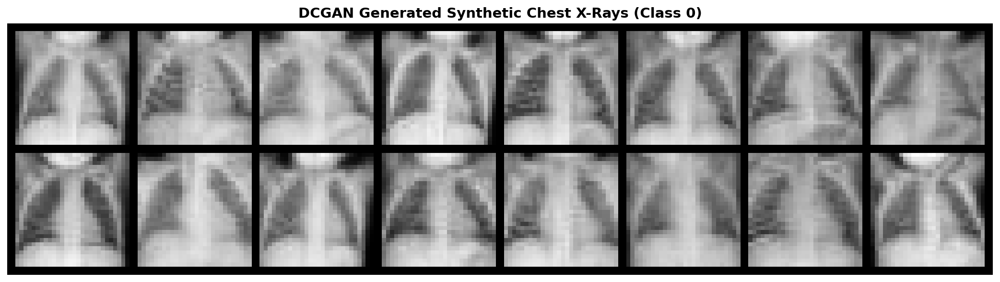
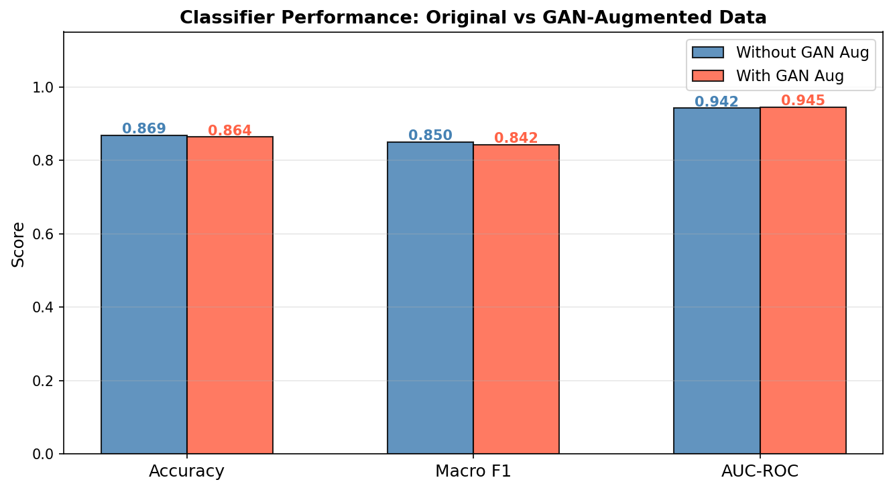

# DCGAN for Chest X-Ray Augmentation — PneumoniaMNIST

Training a DCGAN from scratch in PyTorch to generate synthetic chest X-rays 
and fix class imbalance in a pneumonia detection classifier.

## Problem
PneumoniaMNIST has a 3.5:1 class imbalance (Pneumonia vs Normal).  
A classifier trained naively defaults toward pneumonia — not because it 
learned pathology, but because it learned prevalence.

## Approach
1. Train a DCGAN on the minority class (Normal) only
2. Filter synthetic images using discriminator confidence score
3. Fill 50% of the class gap with synthetic images
4. Calibrate the decision threshold (0.5 → 0.35) to correct probability bias

## Results

| Metric        | Original | GAN-Augmented |
|---------------|----------|---------------|
| Accuracy      | 86.86%   | 86.38%        |
| Macro F1      | 0.8495   | 0.8421        |
| AUC-ROC       | 0.9419   | 0.9451        |
| Normal Recall | 0.57     | **0.66**      |

Accuracy barely moved. That was the point.  
In skewed medical datasets, real progress shows up in minority-class recall — not accuracy.
## Honest Assessment

GAN augmentation did not improve overall accuracy or Macro F1.  
What it did improve was **Normal Recall (0.57 → 0.66)** and **AUC (0.9419 → 0.9451)**.

In a clinical context, missing a healthy patient (false positive) is far less 
costly than missing a pneumonia case (false negative). The GAN helped reduce 
the model's systematic blind spot on the minority class — at the cost of 
marginal overall metric degradation.

**Limitations**
- Dataset resolution is 28×28 — too low for real clinical use
- GAN training at this scale is unstable and results may vary across runs
- A simpler fix (class weights or oversampling) may achieve similar recall 
  gains with far less complexity

This project was an experiment in understanding *where* augmentation helps 
and *where* it does not — not a claim that GANs are the right tool for this problem.

### Generated Chest X-rays (Normal Class)


### Training Metrics — Original vs GAN-Augmented



## Setup
Open pneumonia_dcgan.ipynb and run all cells top to bottom.
Dataset downloads automatically via the medmnist package.

Environment
Python 3.12

PyTorch 2.x

CUDA (optional, falls back to CPU)

```bash
pip install medmnist scikit-learn torch torchvision
